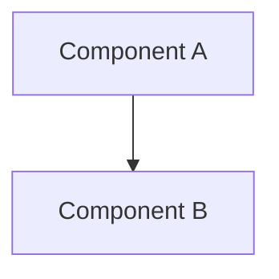

# Documentation Standards

## Format Standards

### Markdown Conventions

- Use standard Markdown syntax
- Headers: Use # for H1, ## for H2, etc.
- Code blocks: Use triple backticks with language
- Links: Use descriptive link text

### File Naming

- Use UPPER_SNAKE_CASE for specification files
- Use descriptive names
- Include .md extension

## Diagram Standards

### Mermaid Diagrams

Use Mermaid for diagrams:



### Diagram Guidelines

- Use clear node names
- Show data flow direction
- Include labels on edges
- Keep diagrams simple

## Code Examples

### Format

- Include language tag
- Show complete examples
- Include comments
- Show expected output

### Example

```python
def example_function():
    """Example function with docstring."""
    return "result"
```

## References

- Always use relative paths
- Link to related documents
- Keep references updated

