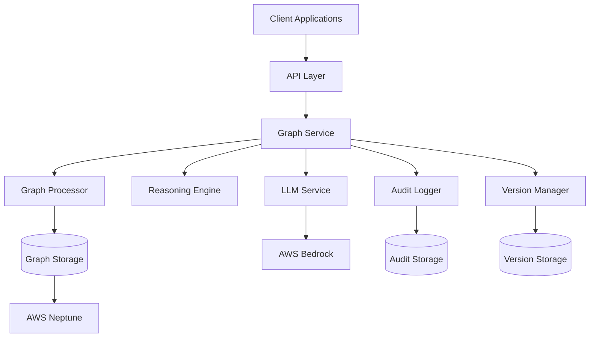
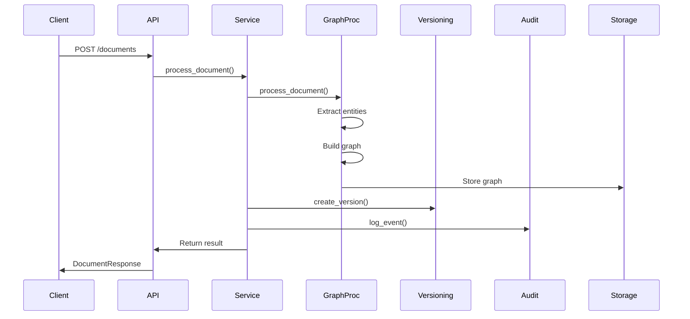
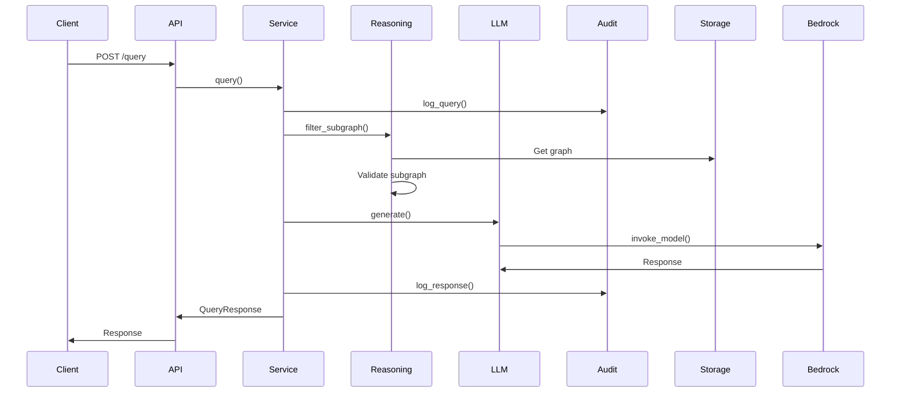

# System Architecture

## Overview

AI.me is built on a modular, microservices-oriented architecture that enables scalability, maintainability, and extensibility. The system is designed to process documents into semantic graphs, reason about graph validity, and generate grounded responses using LLM services.

## High-Level Architecture

## Component Architecture

### 1. API Layer

**Location**: `src/api/`

**Responsibilities**:
- HTTP request handling
- Request validation
- Response formatting
- Authentication/authorization
- Rate limiting

**Technology**: FastAPI, Pydantic

**Key Components**:
- `main.py`: FastAPI application and route definitions
- Request/Response models for API contracts

### 2. Service Layer

**Location**: `src/services/`

**Responsibilities**:
- Business logic orchestration
- Component coordination
- Transaction management
- Error handling

**Key Components**:
- `graph_service.py`: Main service orchestrating all components

### 3. Core Components

#### Graph Processor
**Location**: `src/core/graph/`

**Responsibilities**:
- Document parsing and processing
- Entity extraction
- Relationship detection
- Graph construction

**Technology**: NetworkX, RDFLib

#### Reasoning Engine
**Location**: `src/core/reasoning/`

**Responsibilities**:
- Query understanding
- Subgraph extraction
- Validation and groundedness scoring
- Filtering logic

**Technology**: NetworkX, custom algorithms

#### Version Manager
**Location**: `src/core/versioning/`

**Responsibilities**:
- Version creation and management
- Temporal validity checking
- Version comparison
- History tracking

#### Audit Logger
**Location**: `src/core/audit/`

**Responsibilities**:
- Event logging
- Session tracking
- Trace generation
- Compliance reporting

### 4. Integration Layer

#### AWS Integrations
**Location**: `src/integrations/aws/`

**Components**:
- `bedrock_client.py`: AWS Bedrock LLM integration
- `neptune_client.py`: AWS Neptune graph database integration

#### LLM Service
**Location**: `src/integrations/llm/`

**Responsibilities**:
- LLM provider abstraction
- Multi-provider support
- Response formatting

## Data Flow

### Document Processing Flow

### Query Flow

## Technology Stack

### Backend
- **Language**: Python 3.11+
- **Framework**: FastAPI
- **Graph Processing**: NetworkX, RDFLib
- **Database**: PostgreSQL (audit), AWS Neptune (graphs)
- **LLM**: AWS Bedrock

### Infrastructure
- **Containerization**: Docker
- **Orchestration**: Docker Compose, Kubernetes
- **Cloud**: AWS (Bedrock, Neptune, S3, CloudWatch)

### Development Tools
- **Testing**: pytest, pytest-cov
- **Linting**: ruff, mypy
- **Formatting**: black
- **Security**: bandit

## Scalability Considerations

### Horizontal Scaling
- Stateless API layer enables easy horizontal scaling
- Load balancing across multiple instances
- Database connection pooling

### Caching Strategy
- Subgraph caching for frequent queries
- LLM response caching (planned)
- Metadata caching

### Performance Optimization
- Async I/O for external service calls
- Batch processing for document ingestion
- Graph indexing for fast queries

## Security Architecture

### Authentication & Authorization
- API key authentication (current)
- OAuth 2.0 (planned)
- AWS IAM integration (planned)

### Data Security
- Encryption at rest (database)
- Encryption in transit (TLS)
- Secrets management (AWS Secrets Manager)

### Audit & Compliance
- Complete audit trail
- Immutable audit logs
- Compliance reporting

## Monitoring & Observability

### Logging
- Structured logging (JSON format)
- Log levels: DEBUG, INFO, WARNING, ERROR
- CloudWatch integration

### Metrics
- API response times
- Query processing times
- Error rates
- System health metrics

### Tracing
- Request tracing
- Component interaction tracing
- Performance profiling

## Deployment Architecture

### Development
- Local Docker Compose
- Local databases
- Mock external services

### Staging
- AWS ECS or Kubernetes
- Staging databases
- Real AWS services

### Production
- AWS ECS/Kubernetes with auto-scaling
- Production databases with replication
- Full AWS service integration
- Multi-region support (planned)

## References

- Component Specifications: `docs/architecture/COMPONENT_SPECS.md`
- Data Flow: `docs/architecture/DATA_FLOW.md`
- Graph Model: `docs/architecture/GRAPH_MODEL.md`
- Reasoning Engine: `docs/architecture/REASONING_ENGINE.md`
- Versioning System: `docs/architecture/VERSIONING_SYSTEM.md`

